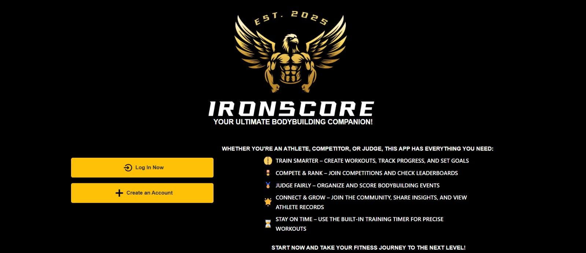

# Hi, I'm Morena 👋

Junior Full-Stack Developer building real-time web applications and scalable database systems.

---

## 🚀 What I Do
- Build full-stack applications with Vue.js, Firebase, and JavaScript  
- Design scalable database systems (MySQL, MongoDB)  
- Develop real-time features and workflow-driven applications  

---

## 🛠️ Tech Stack
**Frontend:** Vue.js, JavaScript, HTML, CSS  
**Backend:** Firebase, Node.js  
**Databases:** MySQL, MongoDB  
**Tools & Deployment:** Git, GitHub, Vercel, Figma  

---

## 📌 Featured Projects

### 🔹 [iron_score](https://github.com/MorenaMartan/IronScore_Vue) — Real-Time Competition Platform  
👉 **Live Demo:** https://iron-score.vercel.app  
## 📸 Preview

Full-stack application that replaces manual bodybuilding judging with real-time digital scoring and live rankings.

- Real-time scoring system using Firebase  
- Live competitor tracking and automatic ranking updates  
- Responsive UI for judges and event organizers  
- Designed for low-latency updates during live competitions  

---

### 🔹 [BeautyDiary](https://github.com/MorenaMartan/BeautyDiary_frontend) — Beauty Service Management App  

Full-stack application for managing beauty service workflows, client records, and appointments, built from real industry experience.

- Vue frontend for structured service and client management  
- Node.js backend API for application logic  
- Designed based on 5+ years of real service workflows  
- Focused on usability and operational efficiency  

---

### 🔹 [Webshop Database](https://github.com/MorenaMartan/Webshop-Database) — E-Commerce System  

Full-stack webshop system with MySQL database design, user authentication, cart management, and admin workflows.

- Designed relational database with ER/EER models  
- Implemented product, user, and order management  
- Built backend logic using Flask and MySQL  
- Focused on data integrity and scalable structure  

---

## 💼 Background
5+ years of customer-facing experience, giving me strong insight into user behavior, workflows, and real-world problem solving — directly applied in my applications.

---

## 📫 Contact
- LinkedIn: https://linkedin.com/in/morenamartan  
- Email: morena.martan@outlook.com  

---

⭐ Open to Junior Full-Stack Developer opportunities.
