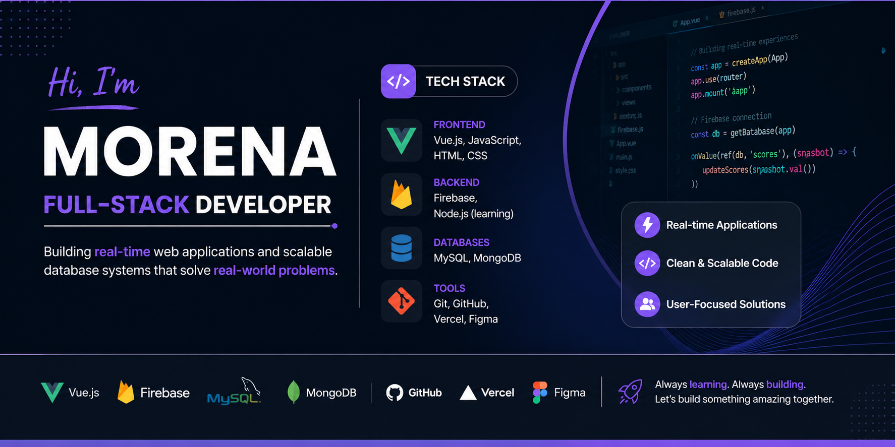

# Hi, I'm Morena 👋

Junior Full-Stack Developer focused on building real-time web applications and scalable database systems.

## 🚀 What I Do
- Build full-stack applications using Vue.js, Firebase, and modern JavaScript
- Design and optimize relational and NoSQL databases (MySQL, MongoDB)
- Develop real-time features and user-focused systems that solve practical problems

## 🛠️ Tech Stack
**Frontend:** Vue.js, JavaScript, HTML, CSS  
**Backend:** Firebase, Node.js (learning)  
**Databases:** MySQL, MongoDB  
**Tools:** Git, GitHub, Vercel, Figma  

## 📌 Featured Projects

### 🔹 iron_score – Real-Time Competition Platform
Full-stack web app that digitizes bodybuilding competition judging with real-time scoring and ranking.

👉 https://iron-score.vercel.app

- Real-time scoring using Firebase  
- Live competitor tracking and ranking updates  
- Responsive UI for judges and organizers  

---

### 🔹 E-Commerce Database System
Relational MySQL database designed for scalable e-commerce operations.

- Complex schema with normalized relationships  
- Stored procedures for cart and order processing  
- Optimized queries for performance  

---

### 🔹 Wedding Planner Application (In Progress)
Full-stack event management platform with real-time vendor coordination.

- Guest management, budgeting, and timeline features  
- Real-time communication system (in development)  
- Built with Vue.js and MongoDB  

---

## 📈 Current Focus
- Improving backend development (Node.js, APIs)  
- Building scalable real-time systems  
- Strengthening full-stack architecture skills  

## 💼 Background
5+ years of customer-facing experience, giving me strong insight into user behavior, workflows, and real-world problem solving.

## 📫 Contact
- LinkedIn: linkedin.com/in/morenamartan
- Email: morena.martan@outlook.com

---

⭐ I’m actively looking for a Junior Developer opportunity where I can contribute to real-world products and grow quickly.
